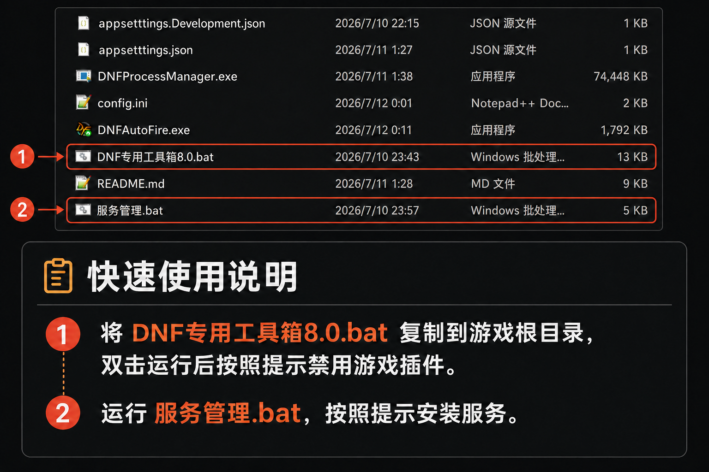

# DNF Process Manager

检测 DNF 生命周期，自动管理连发工具、游戏进程优先级和后台进程的 Windows 服务。

这个程序会在检测到 DNF 启动后，自动完成下面的事情：

- 启动连发程序 `DNFAutoFire.exe`。
- DNF 关闭后自动关闭连发程序。
- 将 DNF 保持在安全的“高于正常”CPU 优先级，减少后台程序争抢 CPU 时的卡顿。
- 等待一段时间后，关闭配置中指定的多余进程。
- 降低指定后台进程的资源占用。

程序以 Windows 服务方式运行，不会显示普通窗口。发布版已经包含 .NET 运行环境，用户不需要另外安装 .NET。

## 发布目录里的文件

请保持下面这些文件在同一个目录中：

- `DNFProcessManager.exe`：服务主程序。
- `服务管理.bat`：一步安装并启动服务，也可以停止、重启或卸载。
- `appsettings.json`：服务配置文件。
- `DNFAutoFire.exe`：连发程序。
- `config.ini`：连发程序的按键和预设配置。
- `DNF专用工具箱8.0.bat`：清理或禁用游戏目录中的无用组件。

不要只复制 `DNFProcessManager.exe`。缺少配置文件或连发程序时，对应功能不会工作。

## 第一次使用



1. 将 `DNF专用工具箱8.0.bat` 复制到游戏根目录，双击运行后按照提示禁用游戏插件。
2. 运行 `服务管理.bat`，按照提示安装服务。

默认发布目录是项目下的 `publish` 文件夹。需要指定其他目录时，可执行 `dotnet publish -p:PublishDir="D:\目标目录\"`。请保持发布目录中的文件完整，不要只移动主程序。

当服务检测到 `DNF.exe` 后，会自动启动同目录下的 `DNFAutoFire.exe`。如果连发程序已经运行，不会重复启动第二个。

## 服务管理脚本怎么用

`服务管理.bat` 提供以下功能：

1. 安装或更新并启动服务：第一次使用或替换新版文件后执行，一步完成安装和启动。
2. 停止服务：临时关闭所有自动处理。
3. 重启服务：修改配置后可以使用。
4. 查看完整状态：检查服务是否正在运行、启动方式和程序路径。
5. 卸载服务：删除 Windows 服务，但不会删除当前目录中的文件。

如果需要移动整个程序目录，请先卸载服务，移动文件后再重新安装。否则 Windows 仍会寻找旧位置的 EXE。

## 连发程序配置

`DNFAutoFire.exe` 和 `config.ini` 必须放在同一个目录。

`DNFAutoFire` 是基于 DAF 的 chenyu 魔改版 DNF 连发工具，支持仅在 DNF 游戏窗口内激活的多键无冲突连发、配置切换、10ms 高精度连发脉冲和多键动态错峰，并通过停止、切换配置及退出时统一补释放按键来降低卡键风险。

内置版本已更新至 `v0.1.3.3`，新增默认关闭的“一键奔跑”：支持全局或按方案配置方向键、触发延迟、双击间隔和游戏内开关热键，并针对搓招、斜向移动、快速变向及技能释放后的奔跑恢复进行了优化。

- 源码与完整说明：[FdolaLily/DNFAutoFire](https://github.com/FdolaLily/DNFAutoFire)

`config.ini` 保存连发按键、预设和快捷键。可以直接使用随发布版提供的默认配置；需要调整时，建议先复制一份作为备份，再修改原文件。

更新发布文件时，如果你已经修改过 `config.ini`，请先备份自己的版本，避免被新版默认配置覆盖。

## appsettings.json 配置说明

默认配置已经可以直接使用。最重要的部分如下：

```json
{
  "Manager": {
    "ProcessName": "DNF.exe",
    "ProcessPollSeconds": 2,
    "ActionDelaySeconds": 60,
    "OptimizeGamePriority": true,
    "GamePriority": "AboveNormal",
    "LimitList": [
      "SGuard64.exe",
      "SGuardSvc64.exe",
      "CrossProxy.exe"
    ],
    "KillList": [
      "GameLoader.exe",
      "TXPlatform.exe"
    ],
    "AutoStart": [
      "DNFAutoFire.exe"
    ],
    "AutoStop": [
      "DNFAutoFire.exe"
    ]
  }
}
```

### ProcessName

要监听的游戏进程。DNF 用户保持下面的设置即可：

```json
"ProcessName": "DNF.exe"
```

### ProcessPollSeconds

每隔多少秒检查一次游戏是否启动。默认值 `2` 已经足够快，不建议设为 `0`。

```json
"ProcessPollSeconds": 2
```

### ActionDelaySeconds

检测到游戏后，等待多少秒再关闭和限制后台进程。默认等待 60 秒：

```json
"ActionDelaySeconds": 60
```

如果电脑启动游戏较慢，可以改为 `90`；不建议设置得太低。

### OptimizeGamePriority 和 GamePriority

这两个选项用于在 DNF 运行时保持合适的 CPU 优先级。默认设置如下：

```json
"OptimizeGamePriority": true,
"GamePriority": "AboveNormal"
```

`AboveNormal` 表示“高于正常”。当后台程序同时占用 CPU 时，它可能让 DNF 更及时地获得处理时间，从而减少部分瞬间卡顿。它不能解决网络延迟、游戏服务器卡顿、显卡性能不足或游戏自身的问题。

不想使用这项功能时，把开关改为：

```json
"OptimizeGamePriority": false
```

不要填写 `High` 或 `Realtime`。过高的优先级可能挤压声音、输入、驱动程序和其他系统任务，结果反而更卡。服务只接受 `Normal` 和 `AboveNormal`，写入其他值时会拒绝启动并在日志中说明原因。

### LimitList

需要降低资源占用的进程名称。例如：

```json
"LimitList": [ "SGuard64.exe", "SGuardSvc64.exe", "CrossProxy.exe" ]
```

不想限制某个进程时，从列表中删除对应名称。保留英文双引号和逗号。

### KillList

游戏启动并等待指定时间后，需要关闭的进程名称。例如：

```json
"KillList": [ "GameLoader.exe", "TXPlatform.exe" ]
```

不确定用途的进程不要随意添加。

### AutoStart

随 DNF 自动启动的程序。相对路径以 `DNFProcessManager.exe` 所在目录为基准，因此默认写法不依赖安装位置：

```json
"AutoStart": [ "DNFAutoFire.exe" ]
```

如果程序放在子目录中，可以这样写：

```json
"AutoStart": [ "Tools\\DNFAutoFire.exe" ]
```

也可以同时启动多个程序：

```json
"AutoStart": [
  "DNFAutoFire.exe",
  "Tools\\AnotherTool.exe"
]
```

仍然支持完整路径。JSON 中的反斜杠需要写两次：

```json
"AutoStart": [ "D:\\DNFTools\\DNFAutoFire.exe" ]
```

保存 `appsettings.json` 后服务会自动读取新配置。自动启动列表会在下一次启动 DNF 时生效；如果游戏已经运行，请关闭游戏后重新启动。

### AutoStop

DNF 关闭后需要自动关闭的程序。默认只关闭连发程序：

```json
"AutoStop": [ "DNFAutoFire.exe" ]
```

服务只会关闭与 DNF 位于同一登录用户中的同名程序，不会影响其他用户会话。不要把音乐播放器等希望继续运行的程序加入这个列表。

不需要自动关闭时可以写成：

```json
"AutoStop": []
```

## DNF 专用工具箱 8.0

工具箱不会自动查找游戏目录。使用方法：

1. 把 `DNF专用工具箱8.0.bat` 复制到 DNF 游戏根目录。
2. 确认脚本旁边可以看到 `DNF.exe`、`start` 和 `Pandora`。
3. 关闭 DNF 和 WeGame。
4. 双击脚本并允许管理员权限。
5. 根据菜单选择禁用、恢复、清理或查看状态。

如果脚本没有放在正确位置，它会提示你复制到游戏根目录，不会继续修改文件。

## 查看日志

服务日志位于程序目录下的 `logs` 文件夹。日志按文件大小自动滚动，最多只保留 1 个日志文件，大小约为 2 MB，不会长期积累占用磁盘空间。滚动后文件名可能带有编号，这是正常现象。

连发程序没有启动时，可以打开最新日志，查找下面两类提示：

- `AutoStart file does not exist`：配置中的文件路径不正确，或文件没有复制完整。
- `Failed to start interactive application`：权限或当前登录会话存在问题，可以先重启服务再试。
- `exited immediately`：程序虽然被 Windows 创建成功，但随后立即退出。请检查 `config.ini` 是否和连发程序放在一起，或尝试手动双击连发程序查看提示。
- `Could not stop process`：目标进程本身拒绝结束。新版只结束配置中写明的进程，不会再终止它的整个子进程树。

## 更新程序

1. 使用服务管理脚本停止服务。
2. 备份自己修改过的 `appsettings.json` 和 `config.ini`。
3. 替换发布目录中的文件。
4. 检查并恢复自己的配置。
5. 运行“安装或更新并启动服务”。

## 常见问题

### 启动游戏后连发没有打开

- 确认 `DNFAutoFire.exe` 与 `DNFProcessManager.exe` 在同一个目录。
- 确认 `AutoStart` 中写的是 `"DNFAutoFire.exe"`。
- 使用服务管理脚本查看服务是否处于 `RUNNING` 状态。
- 查看 `logs` 文件夹中的最新日志。
- 如果修改配置时游戏已经运行，请关闭并重新启动游戏。

### 服务无法启动

- 确认整个发布目录文件完整。
- 重新运行 `服务管理.bat`，选择“安装或更新并启动服务”。
- 不要在服务运行时移动或删除 `DNFProcessManager.exe`。

### appsettings.json 保存后报错

- 检查英文双引号是否成对。
- 列表中的多项内容需要使用英文逗号分隔。
- Windows 完整路径中的 `\` 必须写成 `\\`。
- 可以用发布版中的默认 `appsettings.json` 恢复后重新修改。

### 如何彻底删除

先运行服务管理脚本并选择“卸载服务”，确认成功后再删除整个程序目录。
